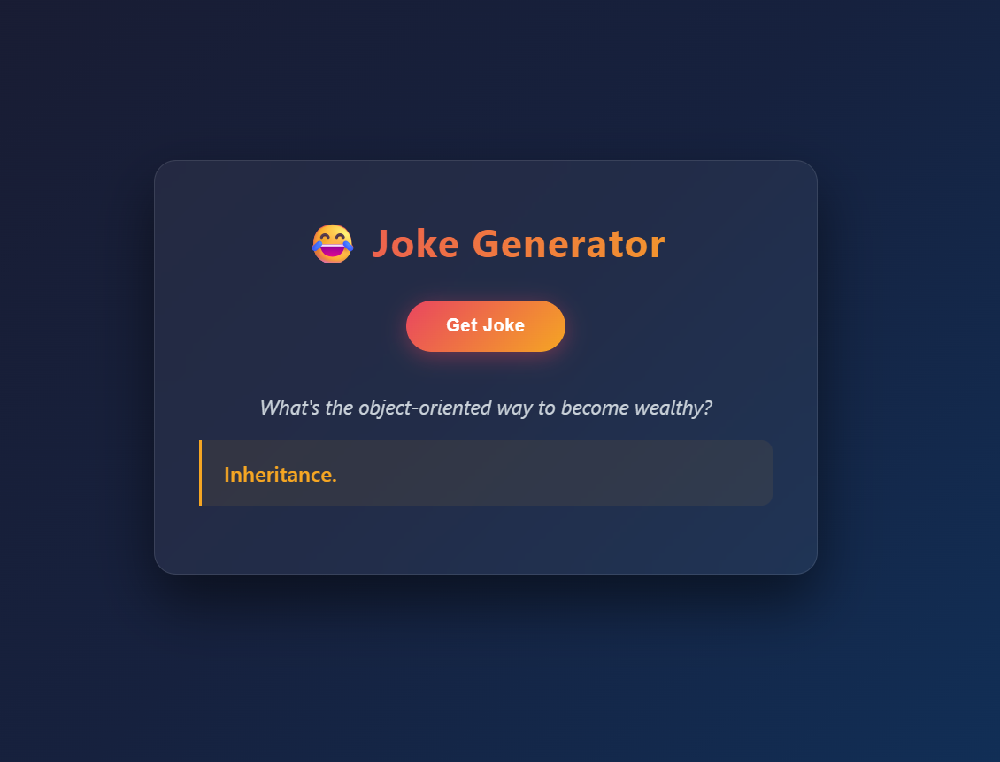

# Joke Generator

A programming joke generator that fetches random jokes from a live API.
Built with vanilla HTML, CSS and JavaScript — no frameworks.

## Live Demo
[View it live](https://ggencas2.github.io/joke-generator)

## Screenshot

## Features
- Fetches random programming jokes from JokeAPI
- Loading state while fetching
- Error handling if the API fails
- Clean glassmorphism UI design
- Fully responsive

## What I used
- HTML5 — semantic structure
- CSS3 — glassmorphism design, gradients, Flexbox, transitions
- JavaScript — async/await, fetch API, DOM manipulation

## What I learned building this
- Fetching data from a real public API using async/await
- Handling loading and error states gracefully
- Using the `finally` block to reset UI after fetch
- Preventing button spam with `disabled` during loading
- Structuring JS with functions outside event listeners

## API used
[JokeAPI](https://v2.jokeapi.dev/) — free, no API key needed

## How to run it
1. Clone the repo:
   \`\`\`bash
   git clone https://github.com/ggencas2/joke-generator.git
   \`\`\`
2. Open `index.html` in your browser
— no install needed